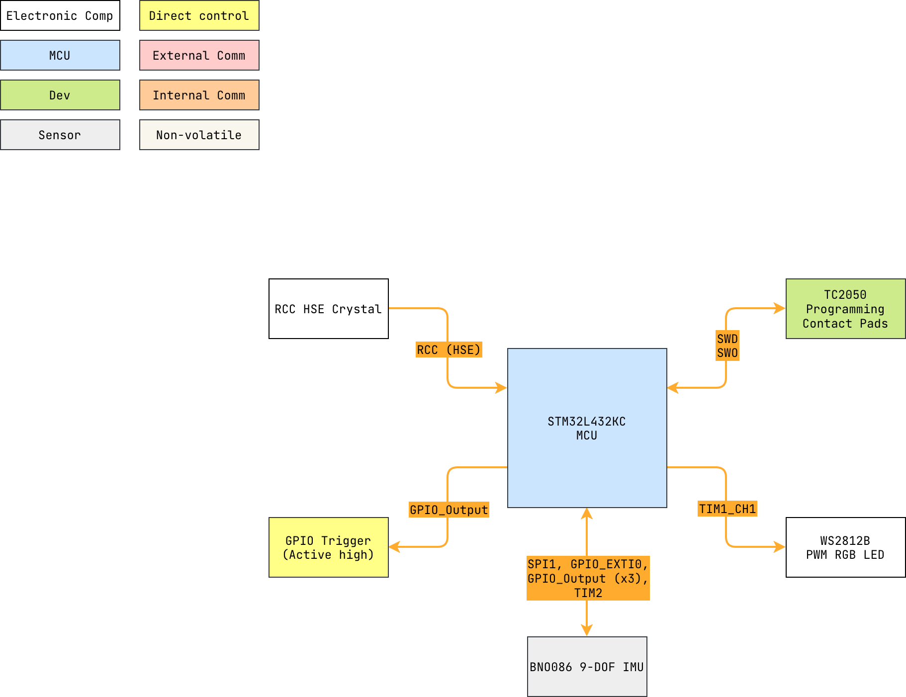
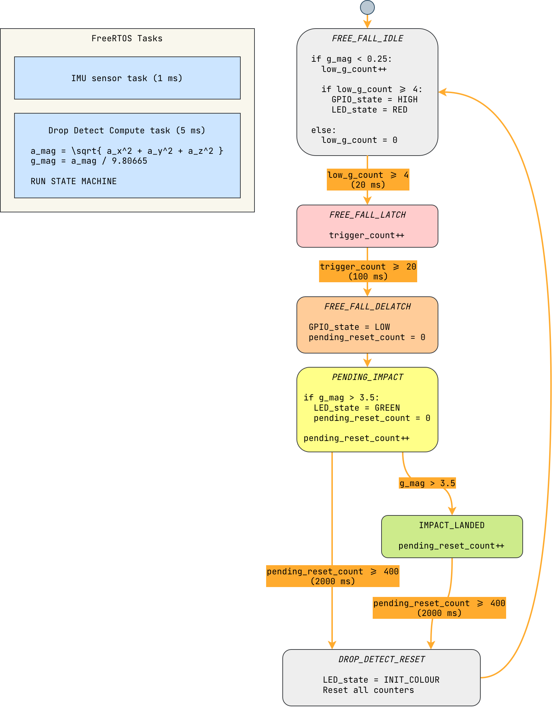

# drop_detect


Soldering iron drop-triggered shield for real time embedded systems university
course (firmware).

---

<details markdown="1">
  <summary>Table of Contents</summary>

<!-- TOC -->
* [drop_detect](#drop_detect)
  * [1 Overview](#1-overview)
    * [1.1 Bill of Materials (BOM)](#11-bill-of-materials-bom)
    * [1.2 Block Diagram](#12-block-diagram)
    * [1.3 Pin Configurations](#13-pin-configurations)
    * [1.4 Clock Configurations](#14-clock-configurations)
  * [2 Software Logic](#2-software-logic)
    * [2.1 Scheduling (FreeRTOS vs Cyclic Executive)](#21-scheduling-freertos-vs-cyclic-executive)
  * [3 Real Time Analysis](#3-real-time-analysis)
    * [3.1 Setup](#31-setup)
    * [3.2 Install Python (pip) Packages](#32-install-python-pip-packages)
    * [3.3 Running the Code](#33-running-the-code)
  * [4 Third-Party Licenses](#4-third-party-licenses)
<!-- TOC -->

</details>

---

## 1 Overview

<div align="center">
  <br>
    Free fall triggered shield and impact detection example.
</div>

### 1.1 Bill of Materials (BOM)

| Manufacturer Part Number | Manufacturer            | Description             | Quantity | Notes |
|--------------------------|-------------------------|-------------------------|---------:|-------|
| STM32L432KC              | STMicroelectronics      | 32-bit MCU              |        1 |       |
| WS2812B                  | (Various)               | PWM Addressable RGB LED |        1 |       |
| BNO085 or BNO086         | CEVA Technologies, Inc. | 9-DOF IMU               |        1 |       |

### 1.2 Block Diagram



> Drawio file here: [drop_detect.drawio](docs/drop_detect.drawio).

### 1.3 Pin Configurations

<details markdown="1">
  <summary>CubeMX Pinout</summary>


</details>

<details markdown="1">
  <summary>Pin & Peripherals Table</summary>

| STM32L432KC | Peripheral              | Config                | Connection                       | Notes                                 |
|-------------|-------------------------|-----------------------|----------------------------------|---------------------------------------|
| PB3         | `SYS_JTDO-SWO`          |                       | Onboard ST-Link                  |                                       |
| PA14        | `SYS_JTCK-SWCLK`        |                       | Onboard ST-Link                  |                                       |
| PA13        | `SYS_JTMS-SWDIO`        |                       | Onboard ST-Link                  |                                       |
|             | `TIM2_CH1`              | PWM no output         |                                  | Scheduler, BNO085 SH2 driver timer.   |
| PA5         | `SPI1_SCK`              |                       | BNO085 Pin 19: `H_SCL/SCK/RX`    |                                       |
| PA4         | `GPIO_Output` (SPI1 CS) | Set high              | BNO085 Pin 18: `H_CSN`           |                                       |
| PA6         | `SPI1_MISO`             |                       | BNO085 Pin 20: `H_SDA/H_MISO/TX` |                                       |
| PA7         | `SPI1_MOSI`             |                       | BNO085 Pin 17: `SA0/H_MOSI`      |                                       |
| PB0         | `GPIO_EXTI0`            | Pull-up, falling edge | BNO085 Pin 14: `H_INTN`          |                                       |
| PB1         | `GPIO_Output`           | Set high              | BNO085 Pin 6: `PS0/Wake`         | Pull low to trigger wake.             |
|             |                         | Hardware pull-up      | BNO085 Pin 5: `PS1`              |                                       |
| PA1         | `GPIO_Output`           | Set high              | BNO085 Pin 11: `NRST`            | Pull low to reset.                    |
| PA8         | `TIM1_CH1`              | PWM Generation CH1    | WS2812B Pin: `DIN`               | DIN pin number depends on IC variant. |
| PC15        | `GPIO_Output`           | Pull-down, set low    | GPIO                             | General trigger pin, active high.     |

</details>

### 1.4 Clock Configurations

```
8 MHz High Speed External (HSE)
 -> Phase-Locked Loop Main (PLLM)
 -> 80 MHz SYSCLK
 -> 80 MHz HCLK
     -> 80 MHz APB1 (Maxed) -> 80 MHz APB1 Timer
     -> 80 MHz APB2 (Maxed) -> 80 MHz APB2 Timer
```

---

## 2 Software Logic



### 2.1 Scheduling (FreeRTOS vs Cyclic Executive)

Two scheduling configurations can be utilized:

1. FreeRTOS implemented and configured with `STM32CubeMX`.
2. A basic cyclic executive hardware timer based scheduler.

Option 1 (FreeRTOS) is utilized for scheduling by default.

Found within [configuration.h](Core/Inc/configuration.h) is the configuration
macro:

```c
#define DROP_DETECT_USE_FREERTOS 1
```

By changing this macro from `1` to `0`, the cyclic executive scheduler is
enabled and FreeRTOS initialization and operation is disabled.

> Note: The `SYS` Timebase Source is set to `TIM16` in order to free `SysTick`
> for the FreeRTOS kernal.

---

## 3 Real Time Analysis

To support additional real time analysis a python statistical
script ([real_time_analysis.py](docs/python/real_time_analysis.py)) was created,
found in [python](docs/python).

The script accepts a `.csv` file of raw logic analyser data exported
from [Saleae Logic 2](https://www.saleae.com/downloads/) for a single channel.


> Saleae is a trademark of the respective owners. Use of these names does
> **not** imply any endorsement by the trademark holders.

### 3.1 Setup

- Assumes python environment is already setup (Python `3.10` or newer).

### 3.2 Install Python (pip) Packages

- Install packages your preferred way. If using pip, use the generic command
  below with [requirements.txt](docs/python/requirements.txt):

```shell
pip install -r requirements.txt
```

### 3.3 Running the Code

The main code can be run right off of `main.py`:

```shell
python real_time_analysis.py
```

---

## 4 Third-Party Licenses

This project uses the following open-source software components:

- **CEVA [sh2](https://github.com/ceva-dsp/sh2)**, CEVA Inc.
    - Licensed under the `Apache License, Version 2.0`.
        - See [
          `NOTICE.txt`](https://github.com/ceva-dsp/sh2/blob/main/NOTICE.txt)
          and code headers, for example in: [
          `sh2.h`](https://github.com/ceva-dsp/sh2/blob/main/sh2.h).

- **STM32Cube HAL**, STMicroelectronics.
    - Licensed under the `3-Clause BSD License`.
        - See [`LICENSE.txt`](Drivers/STM32L4xx_HAL_Driver/LICENSE.txt).

> CEVA and STMicroelectronics are trademarks of their respective owners. Use of
> these names does **not** imply any endorsement by the trademark holders.
